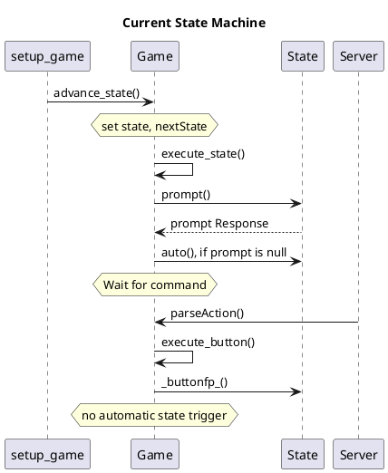
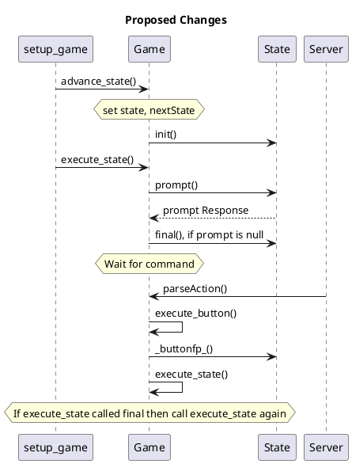
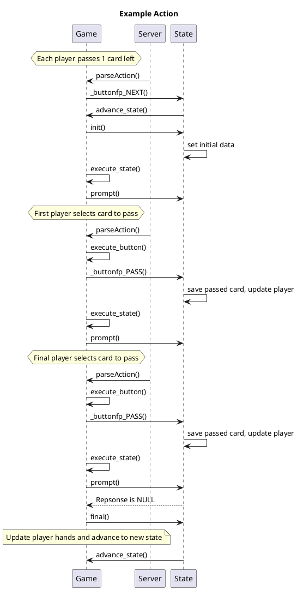
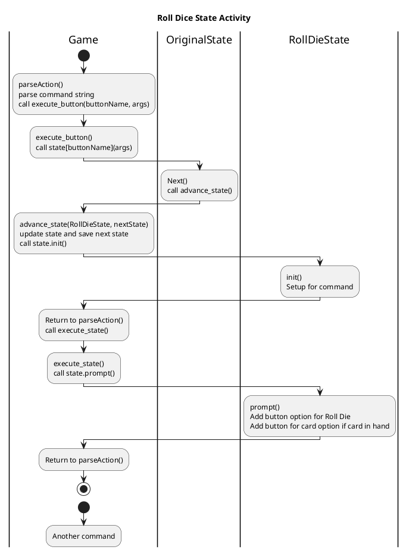

Action List

- Create end of game check routine
- Create routine to check for death of characters (as sauron or corruption move)
- Conflict board start state can be made common
- Conflict board end board can be made common
- Create function for advancement on path (use for story tile / card play)
    - move marker
    - give rewards
- Create function to check for end of conflict board
    - Ends when main path is complete
    - Ends after event 6 is processed
- Story tile stuff remaining
    - advancement on path for good tiles
    - handling event resolution or move to event resolution state
    - Handling of remove 3 items event tiles
- Turn actions
    - Play 2 cards (one grey/one white)
    - Heal 1 space
    - Draw 2 cards
- Other items
    - Buy gandalf cards option
    - Display available Gandalf cards
    - Play other yellow cards