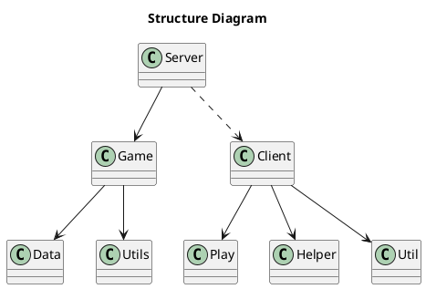
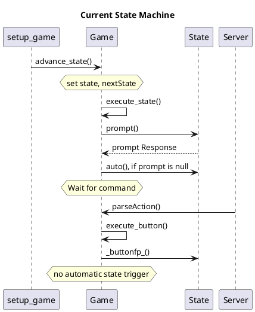
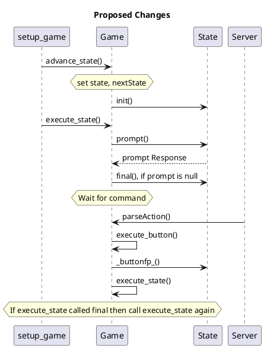
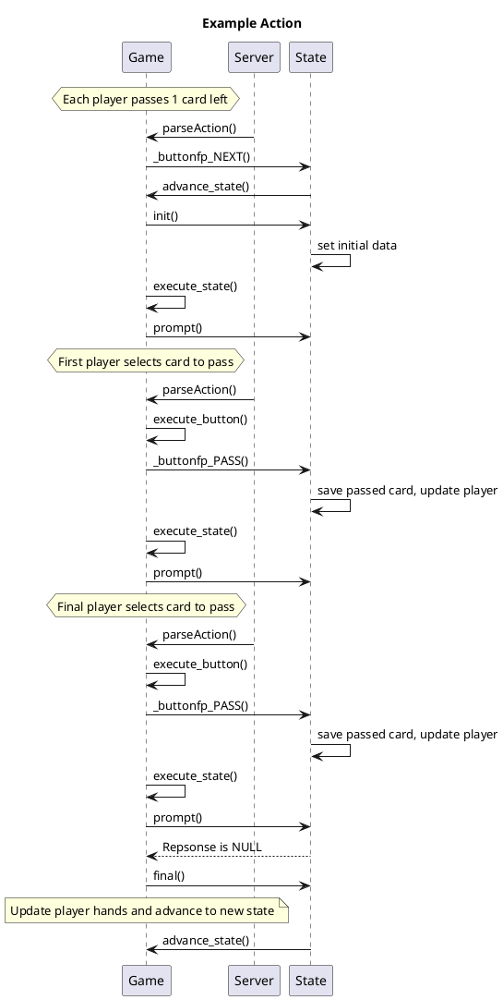
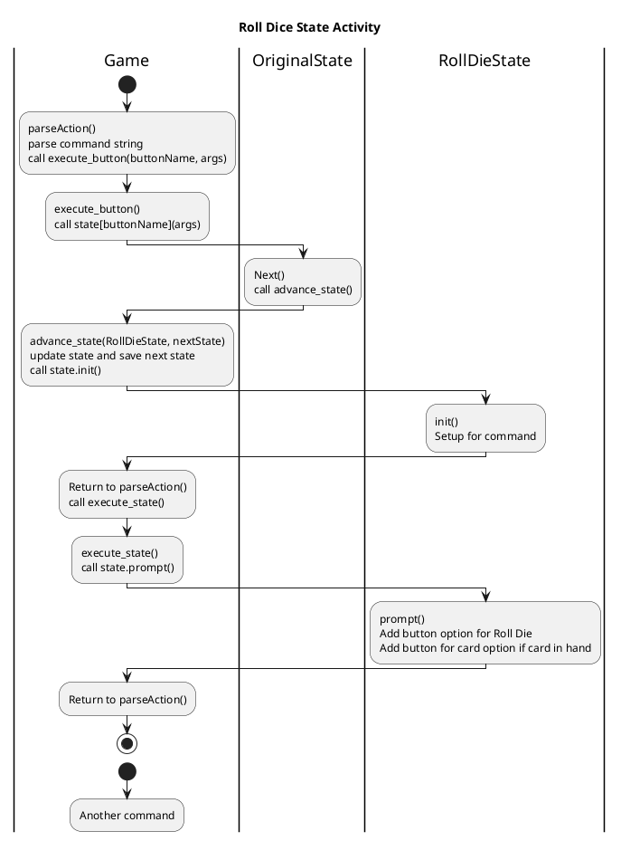

Hello world

Steve

Actions which can be pushed and interrupt a state

- action_roll_die
- action_discard (count, type)
-

Action List

- Buy/play gandalf cards
- Play yellow cards
- discard life tokens for events    ***
- discard shields for events        ***
- Give player card as reward        ***
- Resolve event
-   Moria events
-   Helms deep events
-   Shelob's lair events
-   Mordor events
- Winning game                      ***
- Lose by final event               ***
- Gollum card with die roll when played

- Client Side
-   When cards with a player are present then pull cards to top of play area
-   Allow hide of board?
-   Add corruption value to side display
- Show gandalf cards
- Popup text for cards with card text on yellow cards